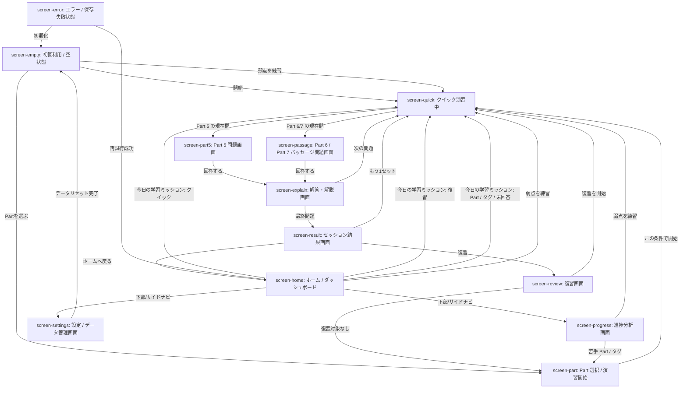
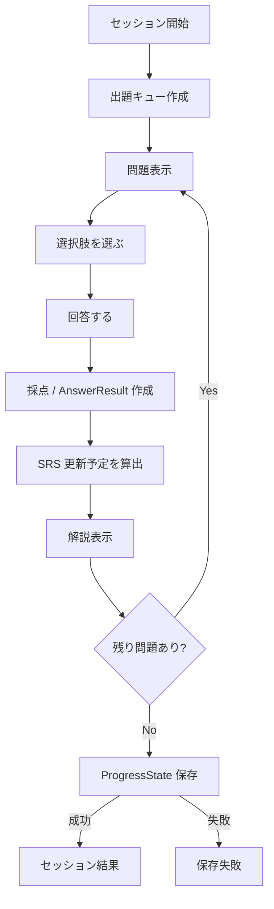
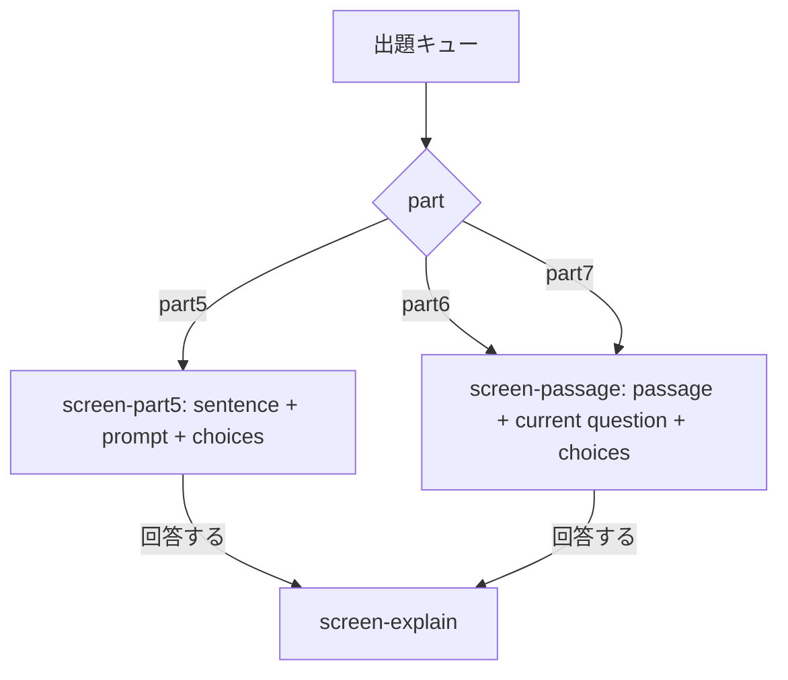
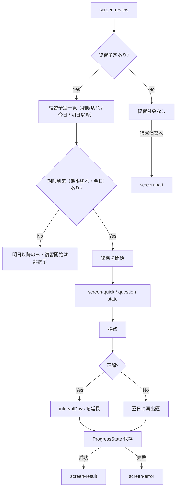
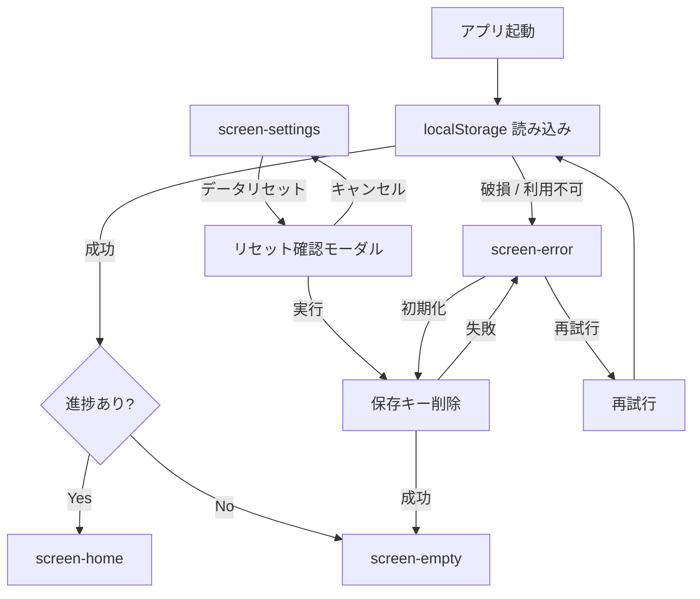

# Wireflow: 5分リーディングドリル

## 1. 目的と読み方

この文書は、Phase 1 の実装者向けにアプリ画面の遷移、画面内イベント、状態更新、例外処理を定義するワイヤーフローである。全体像は Mermaid 図、実装契約は表で示す。視覚仕様は `docs/UI-DESIGN.md`、画面見本は `docs/VISUAL-COMPANION.html`、プロダクト要件とデータ方針は `docs/PRD.md` を正とする。

対象は Phase 1 の12画面のみとする。Listening、ログイン、クラウド同期、多言語、Phase 2 の300問以上投入は扱わない。

## 2. 画面対応表

| Screen ID | 画面名 | 推奨ルート | 実装単位 | 参照元 |
| --- | --- | --- | --- | --- |
| `screen-home` | ホーム / ダッシュボード | `/` | RSC + Client summary | `VISUAL-COMPANION.html` |
| `screen-part` | Part 選択 / 演習開始 | `/practice` | Client Component | `VISUAL-COMPANION.html` |
| `screen-quick` | クイック演習中 | `/practice` | Client state | `VISUAL-COMPANION.html` |
| `screen-part5` | Part 5 問題画面 | `/practice` | Client state | `VISUAL-COMPANION.html` |
| `screen-passage` | Part 6 / Part 7 パッセージ問題画面 | `/practice` | Client state | `VISUAL-COMPANION.html` |
| `screen-explain` | 解答・解説画面 | `/practice` | Client state | `VISUAL-COMPANION.html` |
| `screen-result` | セッション結果画面 | `/practice` | Client state | `VISUAL-COMPANION.html` |
| `screen-review` | 復習画面 | `/review` | Client Component | `VISUAL-COMPANION.html` |
| `screen-progress` | 進捗分析画面 | `/progress` | RSC + Client summary | `VISUAL-COMPANION.html` |
| `screen-settings` | 設定 / データ管理画面 | `/settings` | Client Component | `VISUAL-COMPANION.html` |
| `screen-empty` | 初回利用 / 空状態 | `/` | Client conditional state | `VISUAL-COMPANION.html` |
| `screen-error` | エラー / 保存失敗状態 | current route | Client error state | `VISUAL-COMPANION.html` |

`/practice` 配下では、Part 選択、問題表示、解説、結果を URL 分割せず Client Component の状態遷移で扱う。ブラウザ更新時は、未完了セッションを復元しない前提で `/practice` の Part 選択に戻してよい。

## 3. 全体ナビゲーション

## 4. クイック演習フロー

### 4.1 セッション種別

| 種別 | 入り口 | 出題単位 | 完了条件 |
| --- | --- | --- | --- |
| 5問クイック | `screen-home`, `screen-empty`, `screen-part` | Part 5 は5問、Part 6/7 はパッセージセット内の設問 | 5問またはセット内設問の回答完了 |
| Part 指定 | `screen-part`, `screen-progress` | 選択された Part のみ | セッション内設問の回答完了 |
| 復習 | `screen-review`, `screen-result` | `dueDate <= today` の SRS 対象 | 復習キューの回答完了またはユーザー中断 |
| 弱点優先 | `screen-home`, `screen-empty`, `screen-progress` | Part / タグ別正答率が最低の候補（回答3件未満は Part 5 クイックへフォールバック） | セッション内設問の回答完了 |

復習以外のセッションでは、進捗データを読み込める場合、同じ出題条件内で `未回答 -> SRS 期限到来 -> 誤答履歴あり -> 正答済み` の順にキューを作る。出題数が不足する場合は回答済み問題で補完し、Part 6 / Part 7 は選ばれたパッセージセット内の設問も同じ優先順で表示する。

### 4.2 Part 別出題分岐

Part 6 / Part 7 は、パッセージ本文を表示したまま現在の設問に回答する。パッセージセット内に複数設問がある場合、解説後は同じパッセージ内の次設問へ戻る。

## 5. 復習フロー

復習予定は期限切れ / 今日 / 明日以降の3グループに分類して一覧表示する。復習開始の対象は期限到来（期限切れ・今日）のみで、明日以降だけの場合は一覧を表示しつつ復習開始ボタンは出さない。

SRS 間隔は PRD の方針通り `1日 -> 3日 -> 7日 -> 14日 -> 30日` とする。不正解時は翌日に戻し、30日間隔をクリアした問題は定着済みとして通常の復習キューから外してよい。

## 6. 設定・初回・エラーフロー

`screen-error` は専用ルートではなく、現在のルート上で表示する復旧状態として扱う。保存失敗が演習中に発生した場合は、未保存の回答を可能な限りメモリ上に保持し、再試行ボタンで同じ保存処理を再実行する。

## 7. 画面別イベント表

| Screen ID | 主イベント | 遷移先 | 状態更新 |
| --- | --- | --- | --- |
| `screen-empty` | `今日の学習ミッション: クイック` | `screen-quick` | 初期セッションを作成 |
| `screen-empty` | `Partを選ぶ` | `screen-part` | なし |
| `screen-empty` | `弱点を練習` | `screen-quick` | Part / タグ別正答率の最低候補から出題キューを作成 |
| `screen-home` | `今日の学習ミッション: クイック` | `screen-quick` | 指定 Part でセッション作成 |
| `screen-home` | `今日の学習ミッション: 復習` | `screen-quick` | 期限到来 SRS から復習キューを作成 |
| `screen-home` | `今日の学習ミッション: 苦手 Part / 苦手タグ` | `screen-quick` | Part / タグ条件で出題キューを作成 |
| `screen-home` | `今日の学習ミッション: 未回答` | `screen-quick` | 未回答問題を優先し、不足時は回答済み問題で補完して出題キューを作成 |
| `screen-home` | `弱点を練習` | `screen-quick` | Part / タグ別正答率の最低候補から出題キューを作成 |
| `screen-part` | `Part / 難易度 / タグを変更` | `screen-part` | 出題条件を更新 |
| `screen-part` | `この条件で開始` | `screen-quick` | 出題キューを作成 |
| `screen-quick` | `現在問を表示` | `screen-part5` or `screen-passage` | 現在問 index を参照 |
| `screen-quick` | `中断` | `screen-home` or `screen-part` | 未完了セッションを破棄 |
| `screen-part5` | `選択肢を選択` | `screen-part5` | `selectedChoiceId` を更新 |
| `screen-part5` | `回答する` | `screen-explain` | 採点し `AnswerResult` を作成 |
| `screen-passage` | `選択肢を選択` | `screen-passage` | `selectedChoiceId` を更新 |
| `screen-passage` | `回答する` | `screen-explain` | 採点し `AnswerResult` を作成 |
| `screen-explain` | `次へ` | `screen-quick` | 次問 index へ進める |
| `screen-explain` | `最終問題の次へ` | `screen-result` | セッション結果を集計して保存 |
| `screen-result` | `復習する` | `screen-review` | なし |
| `screen-result` | `もう1セット` | `screen-quick` | 同条件で新規セッション作成 |
| `screen-result` | `ホームへ戻る` | `screen-home` | なし |
| `screen-review` | `復習を開始` | `screen-quick` | 期限到来問題で復習セッション作成 |
| `screen-review` | `復習対象なしで通常演習へ` | `screen-part` | なし |
| `screen-progress` | `苦手 Part を選択` | `screen-part` | 選択 Part を初期値にする |
| `screen-progress` | `苦手タグを選択` | `screen-part` | 選択タグを初期値にする |
| `screen-progress` | `弱点を練習` | `screen-quick` | Part / タグ別正答率の最低候補から出題キューを作成 |
| `screen-settings` | `データリセット` | 確認モーダル | まだ削除しない |
| `screen-settings` | `リセット実行` | `screen-empty` | `toeicReadingProgress:v1` を削除 |
| `screen-error` | `再試行` | 元画面 or `screen-home` | 失敗した保存/読み込み処理を再実行 |
| `screen-error` | `初期化` | `screen-empty` | 保存キー削除を試行 |

## 8. 状態更新タイミング

| タイミング | 更新対象 | 永続化 | 失敗時 |
| --- | --- | --- | --- |
| アプリ起動 | `ProgressState` 読み込み | 読み込みのみ | `screen-error` |
| セッション開始 | `activeSession` 作成 | 原則メモリのみ | 出題不可なら `screen-part` へ戻す |
| 選択肢選択 | `selectedChoiceId` | メモリのみ | なし |
| 回答確定 | `AnswerResult`, 正誤, 経過時間 | 可能なら即時保存を試行 | 失敗してもメモリ保持し `screen-error` で再試行 |
| 解説表示 | SRS 更新予定の表示 | まだ確定保存しなくてよい | なし |
| 次問へ進む | `currentIndex` | メモリのみ | なし |
| セッション完了 | 集計、SRS、連続学習日数 | `localStorage` へ保存 | `screen-error` |
| 復習回答で正解 | `intervalDays`, `dueDate`, `correctStreak` | セッション完了時に保存 | `screen-error` |
| 復習回答で不正解 | `intervalDays = 1`, 翌日 `dueDate` | セッション完了時に保存 | `screen-error` |
| データリセット | 保存キー削除 | `localStorage.removeItem` | `screen-error` |

永続化キーは PRD の `toeicReadingProgress:v1` を使う。保存データの `version` が未対応の場合は破損扱いにし、`screen-error` で初期化導線を出す。

## 9. 実装メモ

- `screen-part5` と `screen-passage` は `/practice` 内の表示状態であり、個別 URL にしない。
- `screen-explain` は直前の回答結果を必要とするため、直接 URL で開く対象にしない。
- `screen-result` はセッション完了後の集計結果を必要とするため、直接 URL で開いた場合は `/practice` の Part 選択に戻す。
- 下部タブまたはサイドナビで移動する場合、未完了セッションがあれば中断確認モーダルを出す。
- `localStorage` が利用できないブラウザでは、学習はメモリ上で継続できても再訪復元は保証しない。ユーザーには `screen-error` で端末内保存が使えないことを明示する。
- ETS 非提携とオリジナル問題方針は `screen-home` と `screen-settings` で表示する。
- Visual Companion の HTML アンカーは開発用の参照 ID であり、実アプリの DOM ID と完全一致させる必要はない。ただし画面名と状態名は本書の `Screen ID` と対応させる。

## 10. 受け入れ確認

- Phase 1 の12画面すべてに遷移または表示条件が定義されている
- 5問クイック、Part 指定、タグ指定、未回答優先、復習の開始導線が定義されている
- 回答、解説、結果、SRS 更新、進捗保存の順序が定義されている
- `localStorage` 読み込み失敗、保存失敗、データ破損、リセット失敗の復旧導線が定義されている
- `PRD.md` の完全クライアント完結方針に反する外部 API やサーバー処理が含まれていない
